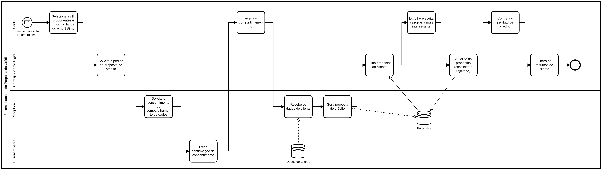
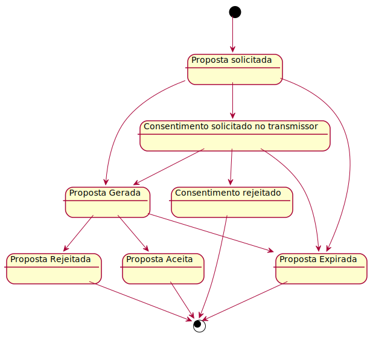

# Open Banking Brasil - Encaminhamento de Proposta de Crédito

Esta é uma proposta de especificação do produto a ser entregue na fase 3C do Open Banking, que trata de propostas de crédito que utilizam os dados compartilhados dos clientes para a geração de propostas mais assertivas.

## Premissas

## Fluxo

## Máquina de Estados do Pedido

## APIs Envolvidas

### API no Correspondente Digital

Dado que o Correspondente Digital não faz parte do ecossistema do Open Banking, nenhuma API deve ser exposta por este participante. Há questões de segurança, que são necessárias implementar, que inviabilizam a sua manutenção pelo Correspondente. Além disso, qualquer API no Correspondente ficaria de fora de testes funcionais (Motor de Conformidade).

### API na Instituição Financeira Receptora

#### Encaminhamento de Pedido de Proposta

POST /credit-proposals

#### Consulta do Pedido de Proposta

GET /credit-proposals

#### Consulta de Proposta Gerada

GET /credit-proposals/{id}/proposals

#### Atualização de Uso da Proposta

PATCH /credit-proposals/{id}/proposals/{id}

### API na Instituição Financeira Transmissora

#### Pedido de Consentimento em Lote